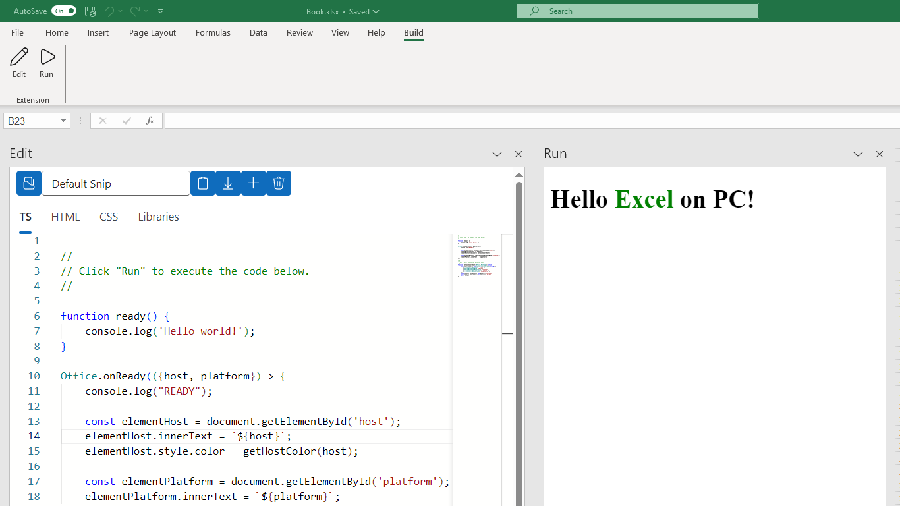
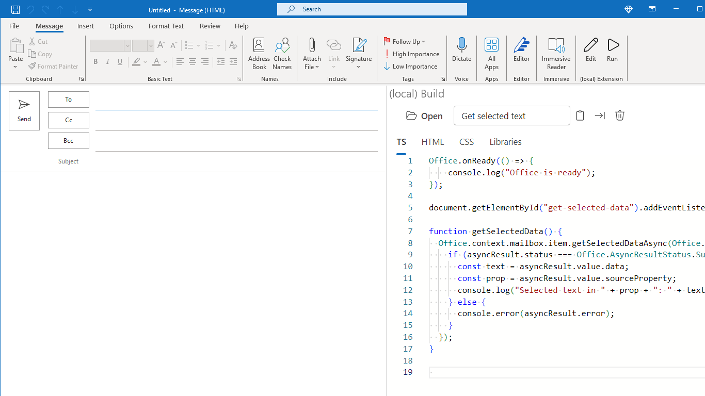
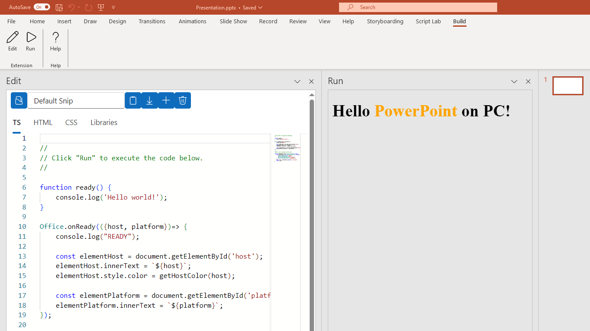
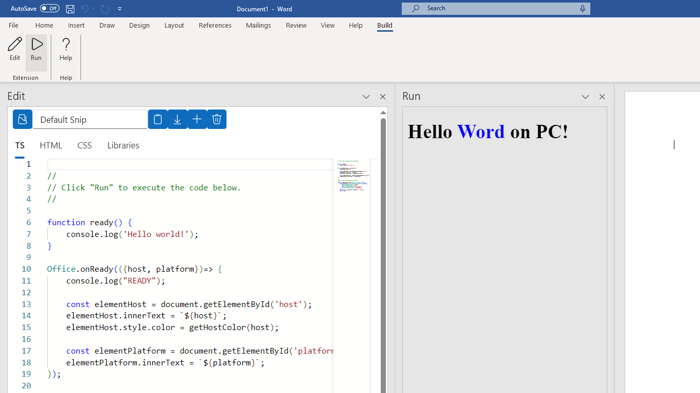

# Listing

## Marketplace Listing

### Eula

```text
https://wandyezj.github.io/build-add-in/statements/eula.html
```

### Privacy

```text
https://wandyezj.github.io/build-add-in/statements/privacy.html
```

### Support

```text
https://wandyezj.github.io/build-add-in/statements/support.html
```

### Name

```text
Build
```

### Summary

```text
Create, run, and share Office Add-in code snips within Excel, Word, PowerPoint or Outlook.
```

### Description

```text
Play with the Office JavaScript API within Excel, Word, PowerPoint, or Outlook!

- Create snips that include JavaScript, HTML, CSS.
- Run code snips and see the result.

[Get Started](https://github.com/wandyezj/build-add-in)

[Contact](https://github.com/wandyezj)

```

### Search Keywords

```text
build develop wandyezj
```

### Marketplace icon


### Screenshots










### Additional information

TODO: video tutorial


## App Compliance

TODO: Link to company website

TODO: App Info Page

TODO: Document disaster recovery plan